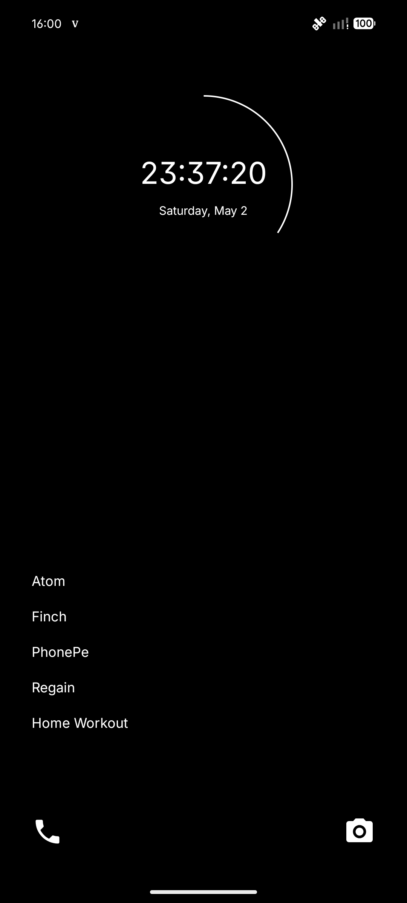

# 🌑 Zenith Launcher

**Reach the highest point of focus.**

Zenith is a minimalist, monochrome Android launcher designed for those who want to reclaim their time and attention. By stripping away icons, colors, and widgets, Zenith reduces cognitive load and encourages intentional usage through extreme simplicity.



---

## 🧘 The Philosophy
Modern smartphones are designed to grab and hold your attention. Zenith is designed to do the opposite. It is a "friction-forward" launcher that treats your apps as tools, not as distractions.

- **No Icons:** Eliminates the dopamine hit from colorful app branding.
- **No Colors:** A strict black-and-white (#000000 and #FFFFFF) aesthetic.
- **Intentional Friction:** Adds a mental "breath" before opening distracting apps.

---

## ✨ Key Features

### 🕒 Clock Arc View
A custom, geometric clock widget that features a circular arc updating smoothly with the seconds. It serves as the single point of focus on your home screen.

### 🔍 Keyboard-First Navigation
Swiftly launch apps by typing. The app list is optimized for speed, allowing you to filter and launch without ever taking your eyes off the text.

### 🧠 Mindful Friction
Configured apps (like social media) are met with a 2-second delay and a reminder to take a breath. This small moment of friction is enough to break the cycle of "zombie scrolling."

### 🔋 Extreme Performance
Built with pure Java and zero heavy dependencies, Zenith is incredibly lightweight, ensuring a snappy experience even on older devices.

---

## 🛠️ Technical Stack
- **Language:** Java 8+
- **Platform:** Android (Min SDK 26)
- **Architecture:** Feature-based modular structure (`core`, `data`, `ui`, `util`)
- **Build System:** Gradle (Groovy DSL)
- **UI Components:** ViewPager2, RecyclerView, Custom Canvas Drawing

---

## 🚀 Getting Started

### Prerequisites
- Android Studio Hedgehog or newer
- Android SDK 26+

### Installation
1. Clone the repository:
   ```bash
   git clone https://github.com/Iraiva01/Zenith.git
   ```
2. Open the project in **Android Studio**.
3. Build and run on your device or emulator.
4. Set Zenith as your **Default Home App**.

---

## 🤝 Contributing
Zenith is an open-source project. If you'd like to contribute to the mission of digital mindfulness, feel free to open a PR or report an issue.

## 📄 License
This project is licensed under the MIT License - see the [LICENSE](LICENSE) file for details.

---
*Created with 🧠 and ❤️ by [Iraiva01](https://github.com/Iraiva01)*
